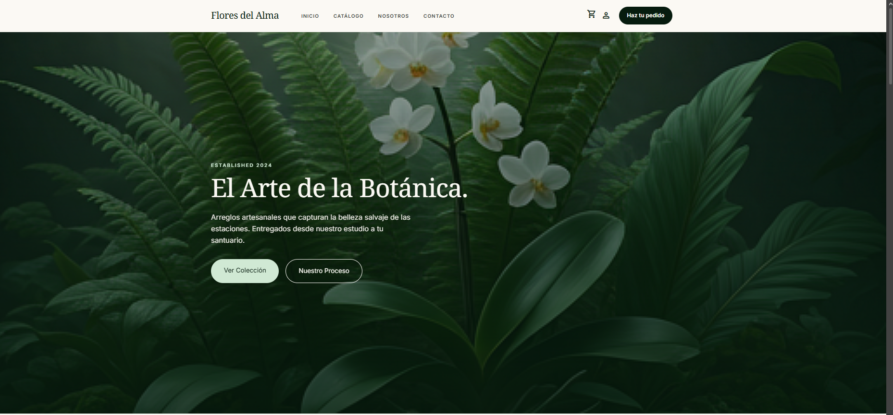
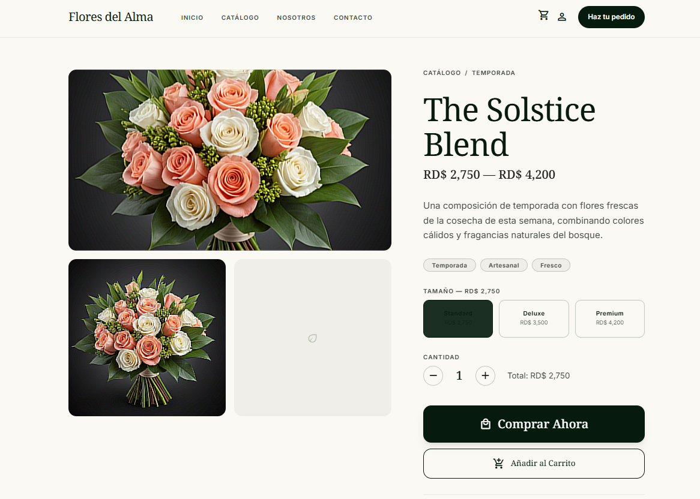
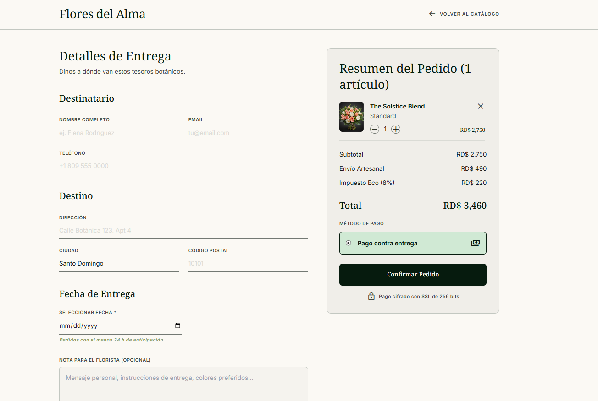
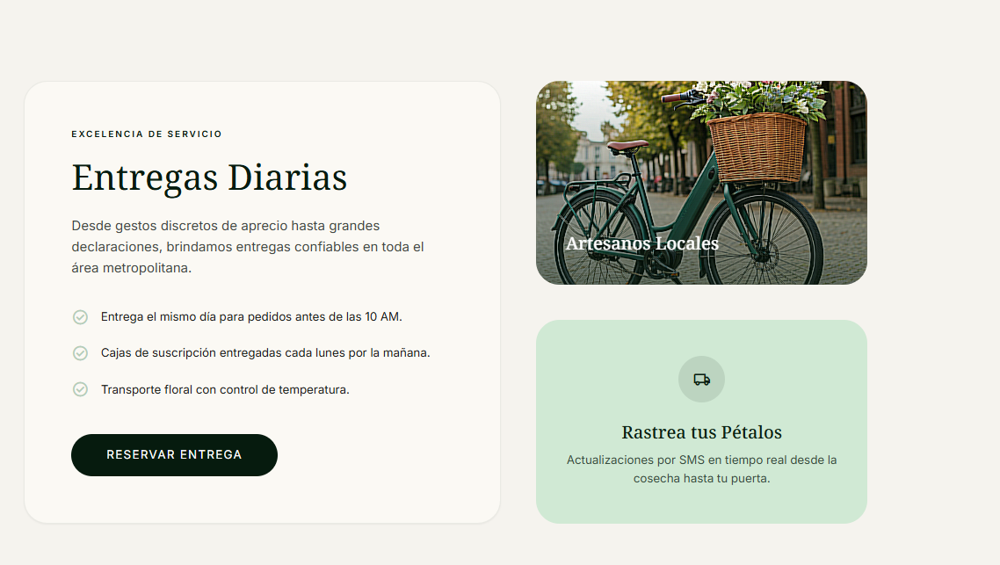

# SoulFlowers — Flores del Alma

> Tienda online de arreglos florales artesanales. E-commerce full-stack con carrito de compras, panel de administración y entrega programada.

---

## Capturas de pantalla

### Hero — Página principal

*Banner a pantalla completa con fondo botánico oscuro. Llamada a la acción directa al catálogo y al proceso artesanal.*

---

### Detalle de producto

*Galería de imágenes del producto, selector de tamaño (Standard / Deluxe / Premium) con precio dinámico, contador de cantidad y acceso directo al carrito.*

---

### Checkout — Detalles de entrega

*Formulario de destinatario y dirección, fecha de entrega programada y resumen del pedido en tiempo real con envío (RD$ 490) e impuesto eco (8%). Pago contra entrega.*

---

### Entregas

*Propuesta de valor: entrega el mismo día, cajas de suscripción semanales y transporte con control de temperatura. Tarjetas de artesanos locales y tracking de pedido por SMS.*

---

## Estructura del proyecto

```
SoulFlowers/                       # Monorepo (npm workspaces)
├── apps/
│   ├── client/                    # Frontend — Next.js 14 App Router
│   │   └── src/
│   │       ├── app/               # Páginas (file-system routing)
│   │       │   ├── page.tsx           # / — Home
│   │       │   ├── catalog/           # /catalog
│   │       │   ├── products/[id]/     # /products/:id
│   │       │   ├── checkout/          # /checkout
│   │       │   ├── login/             # /login
│   │       │   ├── register/          # /register
│   │       │   └── admin/             # /admin (protegido)
│   │       ├── components/
│   │       │   ├── layout/            # Header, Footer
│   │       │   ├── sections/          # Secciones de la landing
│   │       │   └── ui/                # Componentes reutilizables (Badge)
│   │       ├── context/
│   │       │   └── CartContext.tsx    # Estado global del carrito
│   │       ├── hooks/
│   │       │   └── useProducts.ts     # Hook para fetch de productos
│   │       ├── services/
│   │       │   └── api.ts             # Instancia Axios con interceptor JWT
│   │       └── data/
│   │           └── products.ts        # Datos estáticos (página de detalle)
│   │
│   └── server/                    # Backend — Express.js
│       └── src/
│           ├── server.ts              # Punto de entrada
│           ├── config/
│           │   └── database.ts        # Conexión MongoDB
│           ├── models/                # Esquemas Mongoose
│           │   ├── User.ts
│           │   ├── Product.ts
│           │   └── Contact.ts
│           ├── routes/                # Controladores REST
│           │   ├── auth.ts
│           │   ├── products.ts
│           │   ├── contact.ts
│           │   └── weather.ts
│           ├── middleware/
│           │   └── auth.ts            # JWT protect + adminOnly
│           └── scripts/
│               └── seed.ts            # Datos iniciales de prueba
│
├── docs/
│   ├── TASKS.md
│   └── screenshots/               # Poner las capturas aquí
├── package.json                   # Raíz del workspace
└── README.md
```

---

## Stack tecnológico

| Capa | Tecnología |
|------|-----------|
| Frontend | Next.js 14, TypeScript, Tailwind CSS |
| Backend | Express.js, TypeScript |
| Base de datos | MongoDB Atlas (Mongoose) |
| Autenticación | JWT + bcryptjs |
| HTTP client | Axios |
| API externa | OpenWeatherMap |
| Deploy frontend | Vercel |
| Deploy backend | Render / Railway |

---

## Lógica principal

### Autenticación
1. El usuario se registra → la contraseña se hashea con **bcryptjs** antes de guardarse en MongoDB.
2. Al hacer login el servidor valida el hash y devuelve un **JWT** con `userId` y `role`, vigente 7 días.
3. El frontend guarda el token en `localStorage` y lo inyecta en cada petición vía un **interceptor de Axios**.
4. El middleware `protect` en el backend verifica el token en cada ruta protegida; `adminOnly` comprueba además que `role === 'admin'`.

### Carrito de compras
- Estado global manejado con **React Context API** (`CartContext`).
- Persiste en `localStorage` (clave `fda_cart`) para sobrevivir recargas.
- Cada ítem tiene: `productId`, `name`, `size` (Standard/Deluxe/Premium), `price`, `qty`, `img`.
- El checkout calcula en tiempo real: subtotal + 490 RD$ de envío + 8% de impuesto.
- Al confirmar el pedido, el formulario se envía como mensaje a `POST /api/contact`.

### Catálogo y productos
- Los productos se obtienen de la API con el hook `useProducts` (manejo de `loading` / `error` / `data`).
- La página de detalle usa datos **estáticos** (`data/products.ts`) con 3 niveles de precio por producto.
- El panel admin permite crear, editar y desactivar productos (borrado lógico: `isActive: false`).

### Clima
- El backend actúa como **proxy** hacia OpenWeatherMap para no exponer la API key en el cliente.
- Respuestas cacheadas en memoria durante 10 minutos.

---

## API — Endpoints

| Método | Ruta | Descripción | Auth |
|--------|------|-------------|------|
| POST | /api/auth/register | Registrar usuario | — |
| POST | /api/auth/login | Iniciar sesión | — |
| GET | /api/auth/me | Perfil autenticado | JWT |
| GET | /api/products | Listar productos (filtros, paginación) | — |
| GET | /api/products/:id | Producto por ID | — |
| POST | /api/products | Crear producto | Admin |
| PATCH | /api/products/:id | Actualizar producto | Admin |
| DELETE | /api/products/:id | Desactivar producto | Admin |
| POST | /api/contact | Enviar mensaje / pedido | — |
| GET | /api/contact | Listar mensajes | Admin |
| PATCH | /api/contact/:id | Actualizar estado del mensaje | Admin |
| GET | /api/weather?city= | Clima en tiempo real | — |
| GET | /api/health | Estado del servidor | — |

---

## Levantar el proyecto

```bash
# 1. Clonar el repo
git clone <url-del-repo>
cd SoulFlowers

# 2. Instalar dependencias
npm install

# 3. Configurar variables de entorno
cp apps/client/.env.example apps/client/.env.local
cp apps/server/.env.example apps/server/.env
# → Llenar MONGODB_URI, JWT_SECRET, OPENWEATHER_API_KEY

# 4. (Opcional) Cargar datos de prueba
npm run seed --workspace=apps/server

# 5. Levantar todo en paralelo
npm run dev
```

- **Frontend** → http://localhost:3000  
- **Backend** → http://localhost:4000  
- **Admin de prueba** → `admin@floresdelalma.com` / `Admin1234!`

---

## Variables de entorno

**`apps/client/.env.local`**
```
NEXT_PUBLIC_API_URL=http://localhost:4000
```

**`apps/server/.env`**
```
PORT=4000
FRONTEND_URL=http://localhost:3000
MONGODB_URI=mongodb+srv://...
JWT_SECRET=secreto_de_al_menos_32_caracteres
OPENWEATHER_API_KEY=tu_api_key
```

---

*Proyecto integrador — Next.js · Express · MongoDB · TypeScript*
